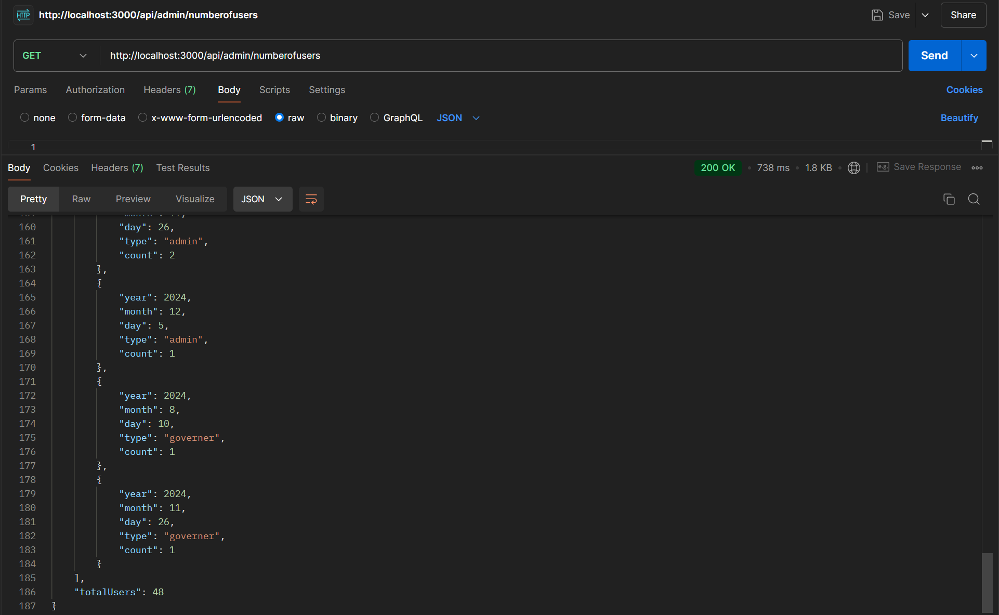

<p align="center">

  

</p>


# Traventure
## Table of Contents  
1. [ Motivation](#-motivation)
2. [ Build Status](#-build-status)
3. [ Code Style](#-code-style)
4. [ Tech and Frameworks used](#%EF%B8%8F-tech-and-frameworks-used)
5. [ Features](#-features--screenshots)
6. [ Code Examples](#-code-examples)
7. [ Installation](#%EF%B8%8F-installation)
8. [ API Reference](#-api-reference)
9. [ Tests](#-tests)
10. [ How to Use](#-how-to-use)
11. [ Contribute](#-contribute)
12. [ Credits](#-credits)
13. [License](#-license)

---

##  Motivation  
Welcome to Traventure, an all-in-one travel platform designed to make vacation planning effortless and exciting! Whether you're dreaming of exploring historic landmarks, unwinding on relaxing beaches, or embarking on family-friendly adventures, our app brings everything together to create the perfect trip. With features tailored to simplify planning and enhance your travel experience, we’re here to turn your dream destinations into reality.

---

##  Build Status  

- Fully operational with all major features implemented.  
- Regular updates planned to add new features and improvements.  
- No known issues as of now.  
---

##  Code Style  

We follow a consistent code style using **Prettier** 

### Useful Commands  

- #### Check formatting using Prettier  
```bash
npm run format

```
- #### And then fix formatting using Prettier
```bash
npm run format:fix

```
---

##  Tech and Frameworks used  
- NodeJs
- Express
- ReactJs
- MongoDB
- Mongoose
- TypeScript
- Prettier


---

##  Features

### User Registration 

- Register as a tourist/tourguide/seller/advertiser with essential details
 

### User Authentication 

- Login and logout securely

### Administrator Functions

- Add another administrator
- Accept or reject tour guides and advertisers and sellers.
- View documents uploaded by Tourguide, Advertisers or sellers


### Account Management:

- Change password. 
- Reset forgotten password via email. 
- Edit/update email or affiliation.

### Seller Functions

- Add a new product
- View sales


### Tourist Functions

- Access the shop
- View available Itineraries, activities, bookings, hotels and flights

Activities management
 - Filter activities by date,budged,tag or language
 - Sort activities by price 


### Iterinary management


- Tour Guide can create/read/update/delete an itinerary 
- Tourists can view and filter itineraries based on various criteria


### Wallet management

- Receive a refund in the wallet for canceled appointments.
- View the amount in the wallet.

---

##  Code Examples  


---

##  Installation  


---

##  API Reference  


<details>
<summary> Activity Endpoint </summary>

`POST /add` -Add a new activity

`GET /` -Get all activities

`GET /:username`  -Get activities of a certain advertiser

`DELETE /delete/:id`   -Delete activity by its ID

`PUT /update/:id`   -Update activity by its ID

`PATCH /toggleInappropriate/:id`  - Updates a certain field (toggleInappropriate) in an activity 

</details>

<details> 
<summary> Admin Endpoint </summary>

`POST /add`  -Creates a new admin

`GET /all`   -Get all users

`POST /add/governer`  -Creates a new governer 

`DELETE /delete/user/:username/:type`  -Deletes user

`GET /externalSellers` -Gets all sellers

`GET /revenues`  -Gets all revenues

`GET /numberofusers`  -Gets the number of users

</details> 


<details> 
<summary> Advertiser Endpoint </summary>

`POST /add`  -create a new advertiser

`GET /:username`  -get an advertiser by username

`PATCH /update/:username`  -change username of a user

`GET /revenue/:username`   -get revenue of a certain advertiser

`GET /numstats/:username`  -get statistics of a certain advertiser
</details> 


---

##  Tests  
We  use Postman to manually test all our api references by making sure the response is as expected.

Here are examples of testing one of our endpoints using Postman:

  

  

---

##  How to Use  


---

##  Contribute  
We welcome contributions to Traventure. All you need to do is:

1- Fork the repo

2- Create a new branch (git checkout -b my-new-feature)

3- Make changes

4- Commit your changes (git commit -am 'Add some feature')

5- Push to the branch (git push origin my-new-feature)

6- Create a new Pull Request

7- Wait for your PR to be reviewed and merged

---

##  Credits  
### Docs 

[Tailwind docs](https://v2.tailwindcss.com/docs)
[Jwt docs](https://jwt.io/introduction)
[React docs](https://legacy.reactjs.org/docs/getting-started.html)
[Prettier docs](https://prettier.io/docs/en/)


### Youtube Videos


---

## 📜 License  
The software is open source under the Apache 2.0 License.


[Apache 2.0](https://www.apache.org/licenses/LICENSE-2.0)
