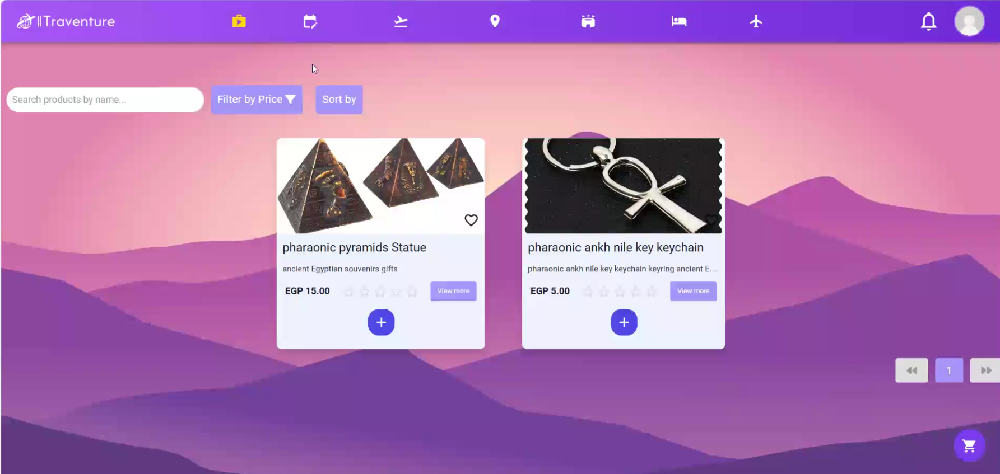
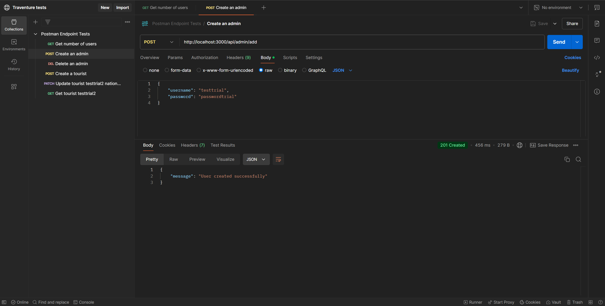

<p align="center">

  

</p>

# Traventure
## Table of Contents  
1. [🚀 Motivation](#-motivation)  
2. [🧱 Build Status](#-build-status)  
3. [🎨 Code Style](#-code-style)  
4. [⚒️ Tech and Frameworks used](#-tech-and-frameworks-used)  
5. [🔥 Features & Screenshots](#-features--screenshots)  
6. [💻 Code Examples](#-code-examples)  
7. [⚙️ Installation](#-installation)  
8. [📚 API Reference](#-api-reference)  
9. [🧪 Tests](#-tests)  
10. [🧑🏻‍🏫 How to Use](#-how-to-use)  
11. [🤝 Contribute](#-contribute)  
12. [©️ Credits](#-credits)  
13. [📜 License](#-license)  

---

## 🚀 Motivation  

Welcome to Traventure, an all-in-one travel platform designed to make vacation planning effortless and exciting! Whether you're dreaming of exploring historic landmarks, unwinding on relaxing beaches, or embarking on family-friendly adventures, our app brings everything together to create the perfect trip. With features tailored to simplify planning and enhance your travel experience, we’re here to turn your dream destinations into reality.

---

## 🧱 Build Status

- Still under development and not deployed yet
- Regular updates planned to add new features and improvements.  
- Still fixing some minor bugs.  
---

## 🎨 Code Style

The  full team works on vscode and uses **Prettier**  as its linter which automatically works when saving (ctrl + s)


---

## ⚒️ Tech and Frameworks used
- NodeJs
- Express
- ReactJs
- MongoDB
- Mongoose
- TypeScript
- Prettier


---

## 🔥 Features & Screenshots


<details> 
<summary> User Registration </summary>

- Register as a tourist/tourguide/seller/advertiser with essential details
 
  

</details> 

<details> 
<summary> User Authentication </summary>

- Login and logout securely

  

</details> 

<details> 
<summary> Administrator Functions </summary>

- Add another administrator

- Accept or reject tour guides and advertisers and sellers.

- View documents uploaded by Tourguide, Advertisers or sellers

  

</details> 

<details> 
<summary> Account Management </summary>

- Change password. 

- Reset forgotten password via email. 

- Edit/update email or affiliation.

  

</details> 

<details> 
<summary> Seller Functions </summary>

- Add a new product

- View sales

  

</details> 

<details> 
<summary> Tourist Functions </summary>

- Access the shop

- View available Itineraries, activities, bookings, hotels and flights

  

</details> 

<details> 
<summary> Activities management </summary>

 - Filter activities by date,budget,tag or language

 - Sort activities by price 

  

</details> 


<details> 
<summary> Itineraries management </summary>

- Tour Guide can create/read/update/delete an itinerary 

- Tourists can view and filter itineraries based on various criteria

  

</details> 


<details> 
<summary> Wallet management </summary>

- Receive a refund in the wallet for cancelled appointments.

- View the amount in the wallet.

  

</details> 


---

## 💻 Code Examples

<details>
<summary>Backend Routes Example</summary>

```js
app.use("/api/admin", adminRouter);
app.use("/api/category", categoryRouter);
app.use("/api/activity", activityRouter);
app.use("/api/preferenceTags", preferenceTagsRouter);
app.use("/api/seller", sellerRouter);
app.use("/api/product", productRouter);
app.use("/api/place", placeRouter);
app.use("/api/advertiser", advertiserRouter);
app.use("/api/tourGuide", tourGuideRouter);
app.use("/api/tourist", touristRouter);
app.use("/api/governer", governerRouter);
app.use("/api/itinerary", itineraryRouter);
app.use("/api/login", LoginRouter);
app.use("/api/historicalTags", historicalTagsRouter);
app.use("/api/user/", changePasswordRouter);
app.use("/api/bookings", BookingRouter);
app.use("/api/purchase", purchaseRouter);
app.use("/api/complaint", complaintRouter);
app.use("/api/feedBack", feedbackRouter);
app.use("/api/admin/", reviewdocsRouter);
app.use("/api/promocode", promocodeRouter);

```
</details>

<details>
<summary>Frontend currency dropdown Example</summary>

```js
const CurrencyDropdown: React.FC = () => {
  const initialCurrency = useSelector(
    (state) => state.exchangeRate.currentCurrency
  );

  const [selectedCurrency, setSelectedCurrency] =
    useState<string>(initialCurrency); // Default selected currency
  const dispatch = useDispatch();

  const {
    currencies,
    loading: currencyLoading,
    error: currencyError,
  } = useGetCurrencies(); // Fetch currencies

  const { exchangeRate, error: rateError } =
    useGetExchangeRate(selectedCurrency); // Fetch exchange rate

  dispatch(
    setExchangeRate({
      rate: exchangeRate,
      currency: selectedCurrency,
    })
  ); // Set exchange rate in redux store

  // Handle currency selection change
  const handleCurrencyChange = (
    event: React.ChangeEvent<HTMLSelectElement>
  ) => {
    setSelectedCurrency(event.target.value);
  };

  const navigate = useLocation();

  if (currencyError || rateError) {
    return <p>Error fetching currencies: ${currencyError}</p>;
  }

  if (currencyLoading) {
    return <p>Loading currencies...</p>;
  }
  return (
    <div
      className={`flex flex-col w-52 
    ${
      navigate.pathname.split("/").length < 4 ||
      navigate.pathname.split("/")[3]?.includes("shop") ||
      navigate.pathname.split("/")[3]?.includes("locations") ||
      navigate.pathname.split("/")[3]?.includes("itineraries") ||
      navigate.pathname.split("/")[3]?.includes("activities") ||
      navigate.pathname.split("/")[3]?.includes("bookings") ||
      navigate.pathname.split("/")[3]?.includes("purchases") ||
      navigate.pathname.split("/")[3]?.includes("flights") ||
      navigate.pathname.split("/")[3]?.includes("hotels")
        ? ""
        : "hidden"
    }`}
    >
      <label htmlFor="currency">Select Currency: </label>
      <select
        id="currency"
        value={selectedCurrency}
        onChange={handleCurrencyChange}
      >
        {currencies.length > 0 &&
          currencies.map((currency) => (
            <option key={currency.code} value={currency.code}>
              {currency.name} ({currency.code})
            </option>
          ))}
      </select>
    </div>
  );
};

export default CurrencyDropdown;


```
</details>

<details>
<summary>Backend Scheduler Function Example</summary>

```js

import handlePromoCode from "./promo_code_function";
const schedule = require("node-schedule");

// Schedule a function to run every day at 3 PM
module.exports = () => {
  schedule.scheduleJob("00 13 * * *", async () => {
    console.log("Running promo code scheduler");
    handlePromoCode();
  });
};


```
</details>


<details>
<summary>Frontend Cart Slice Example</summary>

```js
export interface IProduct {
  _id: string;
  name: string;
  price: number;
  imageUrl: string;
  quantity: number;
  stock: number;
}

const initialState: IProduct[] = [];

const cartSlice = createSlice({
  name: "cart",
  initialState,
  reducers: {
    addToCart: (state, action: PayloadAction<IProduct>) => {
      if (!state.some((item) => item._id === action.payload._id)) {
        const addedProduct = {
          ...action.payload,
          quantity: 1,
          stock: action.payload.quantity - 1,
        };
        state.push(addedProduct);
      }
    },
    removeFromCart: (state, action: PayloadAction<string>) => {
      const newProducts = state.filter((item) => item._id !== action.payload);
      return newProducts;
    },
    clearCart: (state) => {
      return initialState;
    },
    incrementQuantity: (state, action: PayloadAction<string>) => {
      const product = state.find((item) => item._id === action.payload);
      if (!product) return;
      if (product.stock === 0) return;
      const newProduct = {
        ...product,
        quantity: product.quantity + 1,
        stock: product.stock - 1,
      };
      const newProducts = state.map((item) =>
        item._id === action.payload ? newProduct : item
      );
      return newProducts;
    },
    decrementQuantity: (state, action: PayloadAction<string>) => {
      const product = state.find((item) => item._id === action.payload);
      if (!product) return;
      const newProduct = {
        ...product,
        quantity: product.quantity - 1,
        stock: product.stock + 1,
      };
      const newProducts = state.map((item) =>
        item._id === action.payload ? newProduct : item
      );
      return newProducts;
    },
    resetState: () => {
      return initialState;
    },
  },
  
});

export const {
  addToCart,
  removeFromCart,
  clearCart,
  incrementQuantity,
  decrementQuantity,
  resetState
} = cartSlice.actions;
export default cartSlice.reducer;


```
</details>


<details>
<summary>Frontend Filter Example</summary>

```js

interface FilterComponentProps {
  onApplyFilters: (filters: {
    category: string;
    minPrice: number | null;
    maxPrice: number | null;
    tags: string[];
    date: string | null;
  }) => void;
}

const FilterComponent: React.FC<FilterComponentProps> = ({ onApplyFilters }) => {
  const [showFilters, setShowFilters] = useState(false);
  const [categoryFilter, setCategoryFilter] = useState('');
  const [minPriceFilter, setMinPriceFilter] = useState<number | null>(null);
  const [maxPriceFilter, setMaxPriceFilter] = useState<number | null>(null);
  const [tagsFilter, setTagsFilter] = useState<string>('');
  const [dateFilter, setDateFilter] = useState<string | null>(null);

  const toggleFilters = () => {
    setShowFilters(!showFilters);
  };

  const handleApplyFilters = () => {
    onApplyFilters({
      category: categoryFilter,
      minPrice: minPriceFilter,
      maxPrice: maxPriceFilter,
      tags: tagsFilter.split(',').map(tag => tag.trim()),
      date: dateFilter,
    });
  };

  return (
    <div className="max-w-[30%] mx-auto p-4 bg-white shadow-md rounded-lg">
      <button
        onClick={toggleFilters}
        className="mt-4 bg-gray-300 text-gray-700 p-2 rounded-lg hover:bg-gray-400 transition-colors">
        {showFilters ? 'Hide Filters' : 'Show Filters'}
      </button>

      {showFilters && (
        <div className="mt-4 border-t pt-4">
          <h2 className="text-lg font-semibold mb-2">Filters</h2>

          <select
            value={categoryFilter}
            onChange={(e) => setCategoryFilter(e.target.value)}
            className="w-full p-3 border border-gray-300 rounded-lg focus:outline-none focus:ring-2 focus:ring-blue-500 mb-2"
          >
            <option value="">Category</option>
         
          </select>

          <div className="flex space-x-2 mb-2">
            <input
              type="number"
              value={minPriceFilter || ''}
              onChange={(e) => setMinPriceFilter(e.target.value ? parseFloat(e.target.value) : null)}
              placeholder="Min Price"
              className="flex-1 p-3 border border-gray-300 rounded-lg focus:outline-none focus:ring-2 focus:ring-blue-500"
            />
            <input
              type="number"
              value={maxPriceFilter || ''}
              onChange={(e) => setMaxPriceFilter(e.target.value ? parseFloat(e.target.value) : null)}
              placeholder="Max Price"
              className="flex-1 p-3 border border-gray-300 rounded-lg focus:outline-none focus:ring-2 focus:ring-blue-500"
            />
          </div>

          <input
            type="text"
            value={tagsFilter}
            onChange={(e) => setTagsFilter(e.target.value)}
            placeholder="Tags (comma-separated)"
            className="w-full p-3 border border-gray-300 rounded-lg focus:outline-none focus:ring-2 focus:ring-blue-500 mb-2"
          />

          <input
            type="date"
            value={dateFilter || ''}
            onChange={(e) => setDateFilter(e.target.value ? e.target.value : null)}
            className="w-full p-3 border border-gray-300 rounded-lg focus:outline-none focus:ring-2 focus:ring-blue-500 mb-2"
          />

          <button
            onClick={handleApplyFilters}
            className="mt-4 bg-blue-600 text-white p-2 rounded-lg hover:bg-blue-700 transition-colors">
            Apply Filters
          </button>
        </div>
      )}
    </div>
  );
};

export default FilterComponent;

```
</details>


<details>
<summary>Backend Amadeus sdk for flight and hotel data Example</summary>

```js

import Amadeus, { ResponseError, TravelClass } from "amadeus-ts";
import { Console } from "console";

require("dotenv").config();
const amadeus = new Amadeus({
  clientId: process.env.AMADEUS_CLIENT_ID,
  clientSecret: process.env.AMADEUS_CLIENT_SECRET,
});
async function getFlightOffers(
  originLocationCode: string,
  destinationLocationCode: string,
  departureDate: string,
  adults: number,
  children?: number,
  travelClass?: TravelClass,
  nonStop?: boolean,
  max?: number
) {
  try {
    const response = await amadeus.shopping.flightOffersSearch.get({
      originLocationCode,
      destinationLocationCode,
      departureDate,
      adults,
      children,
      travelClass,
      nonStop: true,
      max: 10,
      currencyCode: "USD",
    });

    return response.data;
  } catch (error: unknown) {
    if (error instanceof ResponseError) {
      throw new Error(
        `Error code: ${error.code}, Message: ${error.description}`
      );
    }
    throw new Error("An unknown error occurred");
  }
}

async function getHotelsInCity(cityCode: string) {
  try {
    const response = await amadeus.referenceData.locations.hotels.byCity.get({
      cityCode,
    });

    return response.data;
  } catch (error: unknown) {
    if (error instanceof ResponseError) {
      throw new Error(
        `Error code: ${error.code}, Message: ${error.description}`
      );
    }
    throw new Error("An unknown error occurred");
  }
}
async function getHotelByInfo(
  hotels: any,
  adults: number,
  checkInDate: string,
  checkOutDate: string
) {
  try {
    const hotelList = hotels.slice(0, 50).map((hotel: any) => hotel.hotelId);

    const response = await amadeus.shopping.hotelOffersSearch.get({
      hotelIds: hotelList.join(","),
      adults,
      checkInDate,
      checkOutDate,
      currencyCode: "USD",
    });

    return response.data;
  } catch (error: unknown) {
    console.error(error);
    if (error instanceof ResponseError) {
      throw new Error(
        `Error code: ${error.code}, Message: ${error.description}`
      );
    }
    throw new Error("An unknown error occurred");
  }
}

export { getFlightOffers, getHotelsInCity, getHotelByInfo };


```
</details>


<details>
<summary>Frontend showing the awarded badges for the user</summary>

```js


import React from "react";
import "./BadgePopup.css";
import imagefirst from "../../assets/gold.png";
import imagesecond from "../../assets/silver.png";
import imagethird from "../../assets/bronze.png";

const badges = [
  { level: 1, requirement: 0, name: "Badge Level 1", image: imagethird },
  { level: 2, requirement: 100001, name: "Badge Level 2", image: imagesecond },
  { level: 3, requirement: 500001, name: "Badge Level 3", image: imagefirst },
];

interface BadgePopupProps {
  points: number;
  onClose: () => void;
}

const BadgePopup: React.FC<BadgePopupProps> = ({ points, onClose }) => {
  return (
    <div className="popup-overlay">
      <div className="popup-container">
        <div className="header">
          <h2 className="popup-title">Your Badges</h2>
          <button onClick={onClose} className="close-button">
            Close
          </button>
        </div>
        <ul className="badge-list">
          {badges.map((badge) => (
            <li key={badge.level} className="badge-item">
              <div className="flex items-center">
                
                <span className="badge-name">{badge.name}</span>
                {points < badge.requirement && (
                  <div className="locked-overlay">
                    <span className="lock-icon" role="img" aria-label="Locked">
                      🔒
                    </span>
                  </div>
                )}
              </div>
            </li>
          ))}
        </ul>
      </div>
    </div>
  );
};

export default BadgePopup;


```
</details>


<details>
<summary>Backend Advertiser Schema Example</summary>

```js

import mongoose from "mongoose";
import { IAdvertiser } from "../../Interfaces/Users/IAdvertiser";

const Schema = mongoose.Schema;

const AdvertiserSchema = new Schema({
  username: { type: String, required: true, unique: true },
  email: { type: String, required: true, unique: true },
  password: { type: String, required: true },
  documents: { type: String, required: true },
  company: { type: String },
  isAccepted: { type: Boolean, default: false },
  profilepic: { type: String, default: null },
  wallet: { type: Number, required: true, default: 0 },
  websiteLink: { type: String },
  hotline: { type: String },
  founded: { type: Number },
  description: { type: String },
  location: { type: String },
  timeStamp: { type: Date, required: true, default: Date.now },
});

export default mongoose.model<IAdvertiser>("Advertiser", AdvertiserSchema);


```
</details>


---

## ⚙️ Installation

- Make sure you have [Node](https://nodejs.org/en) and [Git](https://git-scm.com/) installed
```bash
git clone https://github.com/MohamedAbdel-Azeem/Traventure.git
```
- install dependencies for Traventure
```bash
npm run setup
```
- run the web app 


---

## 📚 API Reference


<details>
<summary> Activity Endpoint </summary>

`POST /add` -Add a new activity

`GET /` -Get all activities

`GET /:username`  -Get activities of a certain advertiser

`DELETE /delete/:id`   -Delete activity by its ID

`PUT /update/:id`   -Update activity by its ID

`PATCH /toggleInappropriate/:id`  - Updates a certain field (toggleInappropriate) in an activity 

</details>

<details> 
<summary> Admin Endpoint </summary>

`POST /add`  -Creates a new admin

`GET /all`   -Get all users

`POST /add/governer`  -Creates a new governer 

`DELETE /delete/user/:username/:type`  -Deletes user

`GET /externalSellers` -Gets all sellers

`GET /revenues`  -Gets all revenues

`GET /numberofusers`  -Gets the number of users

</details> 


<details> 
<summary> Advertiser Endpoint </summary>

`POST /add`  -create a new advertiser

`GET /:username`  -get an advertiser by username

`PATCH /update/:username`  -change username of a user

`GET /revenue/:username`   -get revenue of a certain advertiser

`GET /numstats/:username`  -get statistics of a certain advertiser
</details> 

<details>
<summary>Auth Endpoint</summary>

`POST /auth` -Checks permission of a user by verifying the access token
</details> 

<details>
<summary>Booking Endpoint</summary>

`POST /add`  -Create a new booking

`GET /:username`   -Get all bookings of a user

`GET /getHotels/:username`  -Get hotel bookings of a user

`DELETE /cancel/:booking_id`  -Cancel  booking by its ID

`POST /addFlight/:username`  -Create a new flight booking for a user

`POST /addHotel/:username`  -Create a new hotel booking for a user

</details> 

<details>
<summary>Category Endpoint</summary>

`POST /add`  -Create a new category

`GET /`   -Get all categories

`DELETE /delete/:id`   -Delete a category by ID

`PUT /update/:id`   -Update a category by ID

</details>

<details>
<summary>ChangePassword Endpoint</summary>

`PATCH /changePassword`   -Updates a user's password

</details>


<details>
 <summary>Complaint Endpoint</summary>

`POST /add`  -Create a new complaint

`PATCH  /update/:complaintId`  -Update a complaint by its ID

`GET /`  -Get all complaints

`GET /:complaintID`   -Get a complaint by its ID

</details>


<details>
<summary> Feedback Endpoint </summary>

`POST /rateItinerary/:itineraryId` -Add  new rating for an itinerary

`POST /rateTourGuide/:tourGuideUserId`  -Add new rating for a tourguide

`POST /rateActivity/:ActivityId`  -Add new rating for an activity

`GET /canfeedback`   -Checks if a tourist can provide feedback for a tourguide

`GET /showTourGuideReviews/:tourGuideUserId`  -Gets reviews of a certain tourguide by ID

`GET /showActivityReviews/:ActivityId`  -Gets reviews of a certain activity by its ID

`GET /showItineraryReviews/:itineraryId` -Gets reviews of a certain itinerary by its ID

</details>

<details>
<summary> Governer Endpoint</summary>

`POST /add/HistoricalTag`  -Adds  new historical tag

</details>

<details>
<summary>historicalTags Endpoint</summary>

`POST /add`  -Creates a new historical tag

</details>

<details>
<summary> Itinerary Endpoint </summary>

`POST /add`  -Creates a new itinerary

`GET /`  -Gets all itineraries

`GET /:username`  -gets itinerary of a specific user

`GET /get/:itinerary_id`  -gets itinerary by its ID

`PATCH  /update/:id`  -updates an existing itinerary based on its ID

`DELETE /delete/:id`  -deletes an itinerary

`PATCH /toggleActivation/:id`  -toggles the activation status of an itinerary by its ID

`PATCH /toggleInappropriate/:id`  -toggles the "inappropriate" status of an itinerary based on its ID

</details>

<details>
<summary> Places Endpoint</summary>

`GET /`  -gets all places

`GET /:id`  -gets a place by its ID

`POST /add` -Adds a new place

`PATCH /update/:id` -updates a place based on its ID

`DELETE /delete/:id`  -deletes a place

</details>


<details>
<summary> preferenceTags Endpoint </summary>

`POST /add`  -Adds a new preference tag

`GET /`  -gets all preference tags

`DELETE /delete/:id`  -deletes a preference tag by its ID

`PUT /update/:id`  -updates a preference tag by its ID

</details>

<details>
<summary> Product Endpoint </summary>

`POST /add` -Adds a new product

`GET /`  -gets all products

`PATCH /update/:id` -updates a product by its ID

`PATCH /archive/:id`  -Archives a product based on its ID

`PATCH /feedback/:productid`  -Updates feedback for a product based on its ID

</details>

<details>
<summary> PromoCodes Endpoint </summary>

`GET /use/:name`  -uses promo code by its name

`GET /check/:name`  -checks if promo code is still in use by its name

</details>

<details>
<summary> purchase Endpoint </summary>

`POST /buy`   -Adds product to user's cart

`GET /tourist/:touristUsername`  -Gets all the purchases made by a specific tourist

`GET /seller`  -Gets sales information for a seller

`POST /deliver`  -Marks a purchase as delivered

`POST /cancel`  -Used to cancel a purchase

</details>


<details>
<summary> RequestDelete Endpoint </summary>

`DELETE /deleterequestdelete`   -Deletes a user's account deletion request

</details>

<details>
<summary> ReviewDoc Endpoint </summary>

`GET /pendingusers`   -gets all pending users

`PATCH /acceptuser`   -updates the status of a user whether accepted or rejected

</details>

<details>
<summary> Seller Endpoint </summary>

`POST /add`  -create a new seller user

`GET /:username`  -Gets a certain seller

`PATCH /update/:username`  -Update a certain seller by his username

</details>

<details>
<summary> TourGuide Endpoint </summary>

`POST /add`  -create a new tourguide user

`GET /username`  -gets a certain tourguide

`PATCH /update/:username`   -updates a tourguide by his username

`GET /revenue/:username`  -get revenues of a tourguide by his username

`GET "/userstats/:username`  -get stats of users interacting with a tourguide's itinerary

</details>

<details>
<summary> Tourist Endpoint </summary>

`POST /add`  -create a new tourist user

`GET /upcoming` -get all upcoming activities

`GET /id/:id` -get user profile

`GET /:username`  -get a certain tourist's user profile

`PATCH /update/:username`  -update a user

`GET /bookings/:username`  -get all bookings of a certain tourist

`GET /upcoming/:username`  -get all upcoming activities of a certain tourist

`GET /complains/:username`  -get all complaints of a certain tourist

`GET /bookmarks/:username`  -get bookmarks of a certain tourist by his username

`PATCH /updateWallet/:username`  -update a tourist's wallet by his username

`PATCH /bookmark_activity/:username`  -bookmark an activity for a certain tourist

`PATCH /bookmark_itinerary/:username`   -bookmark an itinerary for a certain tourist

`POST /wishlist/:username`  -Add to a wishlist of a tourist

`GET /promo_code/get/:username`  -get promo codes used by a tourist 

`PATCH /promo_code/use/:username` -update the status of a promo code for a specific tourist

`GET /skipTutorial/:username` -gets the status of whether a specific tourist has skipped a tutorial

`PATCH /interested` -Update tourist interest

`PATCH /add/address/:username` -Adds an adress for a tourist

`PATCH /edit/address/:username` -Updates address of a tourist

`PATCH /delete/address/:username` -Deletes address of a tourist

`PATCH /skipTutorial/:username`  -allows a user to mark their tutorial as "skipped".

</details>

---

## 🧪 Tests
We  use Postman to manually test all our api references by making sure the response is as expected.

Here are examples of testing one of our endpoints using Postman:

[Tests Postman Collection](https://elements.getpostman.com/redirect?entityId=39534055-d77464fa-685e-400b-9b78-dfb9e3c907c4&entityType=collection)  

  




---

## 🧑🏻‍🏫 How to Use
- Make sure to follow the [Installation](#-installation) steps first

- Add a `.env` in the `client` and `server`

 `Backend env`
```bash

MONGODB_URI="Your Mongo Connection String"
AMADEUS_CLIENT_ID="Your Amadeus Client ID"
AMADEUS_CLIENT_SECRET="A secret string to use for encrypting passwords"
GMAIL_PASSWORD="Your gmail password"
GMAIL_ADDRESS="Your gmail address"
STRIPE_SECRET_KEY="Stripe secret key"
```

 `Frontend env`

```bash
VITE_API_URL="Currnecy API Key"
VITE_STRIPE_PUBLIC_KEY="Stripe Public key"

```


- Start Traventure

```bash

npm run start
```

---

## 🤝 Contribute
We welcome contributions to Traventure. All you need to do is:

1- Fork the repo

2- Create a new branch (`git checkout -b my-new-feature`)

3- Make changes

4- Commit your changes (`git commit -am 'Add some feature'`)

5- Push to the branch (`git push origin my-new-feature`)

6- Create a new Pull Request

7- Wait for your PR to be reviewed and merged

---

## ©️ Credits

### Docs 

[Tailwind docs](https://v2.tailwindcss.com/docs)

[Jwt docs](https://jwt.io/introduction)

[React docs](https://legacy.reactjs.org/docs/getting-started.html)

[Prettier docs](https://prettier.io/docs/en/)


### Youtube Videos


[React introduction](https://www.youtube.com/watch?v=w7ejDZ8SWv8&t=4485s)

[Express.js](https://www.youtube.com/watch?v=fgTGADljAeg)

[Node.js](https://www.youtube.com/watch?v=mI_-1tbIXQI&list=PLZlA0Gpn_vH_uZs4vJMIhcinABSTUH2bY&index=2)

[Currency Converter](https://www.youtube.com/watch?v=0_Lwi5ucGwM)

[React Stripe ](https://www.youtube.com/watch?v=IhvtIbfDZJI)


---

## 📜 License 
The software is open source under the Apache 2.0 License.


[Apache 2.0](https://www.apache.org/licenses/LICENSE-2.0)
